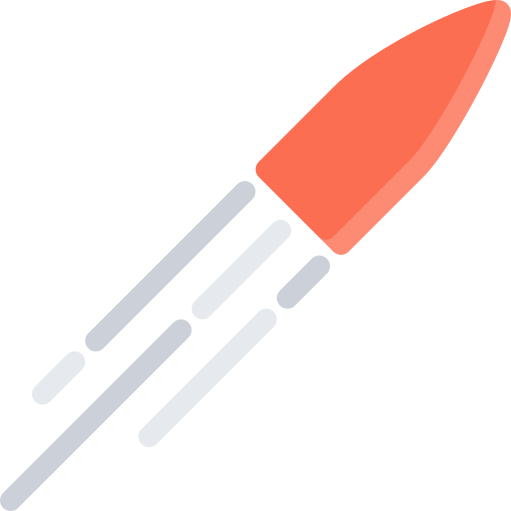

# Bullet



Bullet is a fast and flexible application deploy tool built by Furqan Software and friends.

Complete documentation is available at https://bullettool.com/.

At [Furqan Software](https://furqansoftware.com/), Bullet helps us setup and deploy prototype applications with little effort.

## Getting Started

### Installing From Source

``` go
go get github.com/FurqanSoftware/bullet
```

## Acknowledgements

- [Nikita Golubev](http://www.flaticon.com/authors/nikita-golubev) - For the bullet icon
